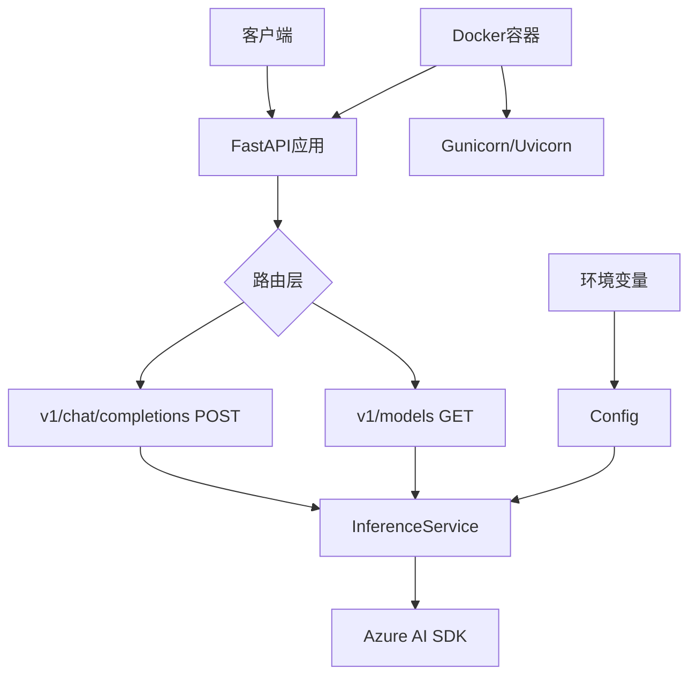

# AI API

这是一个兼容OpenAI API格式的大模型接口项目，基于FastAPI框架构建，支持Azure AI服务集成。

## 功能特点

- 完全兼容OpenAI API格式
- 支持文本补全和对话补全
- 异步处理请求
- API密钥认证
- Prometheus监控集成
- Docker容器化部署

## 架构设计



## 快速开始

### 本地运行
1. 克隆项目
```bash
git clone https://github.com/SwayDy/azure-openai-api.git
cd azure-openai-api
```

2. 安装依赖：
```bash
pip install -r requirements.txt
```

3. 创建.env配置文件：
```ini
AZURE_ENDPOINT=${AZURE_ENDPOINT}
AZURE_API_KEY=${AZURE_API_KEY}
API_KEY=${API_KEY}
HOST=0.0.0.0
PORT=8000
```

4. 启动服务：
```bash
python run.py
# or
uvicorn app.main:app --reload
```

### 构建Docker镜像
```bash
docker build -t ai-api:latest .
```

### Docker部署
```bash
docker-compose -f docker-compose.yml --env-file .env up --build
```

## API端点

- POST /v1/chat/completions - 对话补全
- GET  /v1/models - 获取可用模型列表

## 配置说明

在.env文件中设置以下变量：

| 变量名称         | 说明                         | 示例值                                  |
|------------------|------------------------------|----------------------------------------|
| AZURE_ENDPOINT   | Azure AI服务终结点           | https://your-endpoint.openai.azure.com |
| AZURE_API_KEY    | Azure API密钥                | your-api-key                           |
| API_KEY          | 本地API访问密钥              | your-local-key                         |
| HOST             | 服务监听地址                 | 0.0.0.0                                |
| PORT             | 服务监听端口                 | 8000                                   |

## 使用示例

### 基础请求
```python
import requests

API_URL = "http://localhost:8000/v1/chat/completions"
headers = {
    "Authorization": f"Bearer {os.getenv('API_KEY')}",
    "Content-Type": "application/json",
}
data = {
    "messages": [{"role": "user", "content": "你好"}],
    "max_tokens": 100
}

response = requests.post(API_URL, headers=headers, json=data)
print(response.json())
```

### 流式响应
```python
import requests

API_URL = "http://localhost:8000/v1/chat/completions"
headers = {
    "Authorization": f"Bearer {os.getenv('API_KEY')}",
    "Content-Type": "application/json",
}
data = {
    "messages": [{"role": "user", "content": "你好"}],
    "max_tokens": 100,
    "stream": True
}

with requests.post(API_URL, headers=headers, json=data, stream=True) as response:
    for line in response.iter_lines():
        if line:
            print(line.decode('utf-8'))
```
